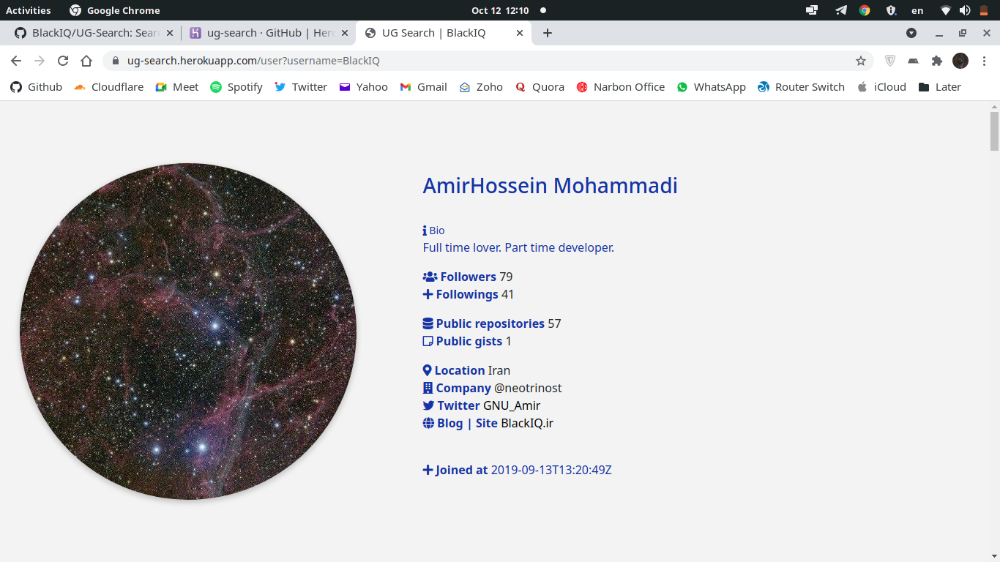
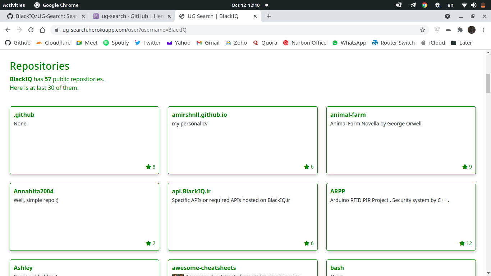
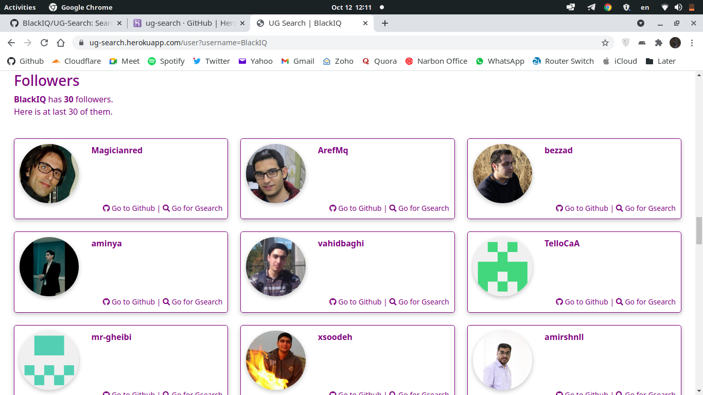

# Search in Github

Here search for users in Github and other stuff!

### This app is working with,

- **Data** Github API
- **BackEnd** Flask
- **Language** Python
- **Package manager** PipEnv
- **Hosted** Heroku
- **Source** on Github

### Where to see

Open [us-search.herokuapp.com/](https://ug-search.herokuapp.com/).

### Contribute

For small changes, open an issue or do it by yourself.

### How to run

- First clone it and go to the directory. Run `pipenv shell`.

> This project is using **PipEnv**. Don't run `pip3 install`.

```shell
$ git clone https://github.com/BlackIQ/UG-Search
$ cd covid
$ pipenv shell
```

- Export variables and run **Flask app**.

```shell
$ export FLASK_APP=wsgi.py
$ export FLASK_ENV=development
$ flask run
```

- After go to `127.0.0.1:5000` in your broswer.

[](#)

[](#)

[](#)

### Hacktoberfest

Now is **October 12** and here is **Hacktoberfest**. Contribute on this project to get label.

### License

This project is licensed under **GPL-3** license

### TODO

- [x] Front-End design
- [x] Deploy
